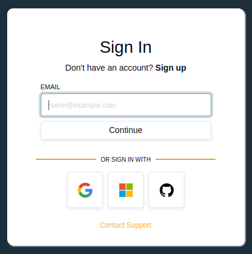

  

# WordPress SSO Login using Authress

    
    
    

The SSO Login plugin for Wordpress - adds SSO html template and login buttons

## Installation
[Install the SSO Plugin](https://wordpress.com/plugins/authress)

### Customizing the SSO Login plugin
[See customizations](./docs/customizations.md)

## Contributing to the Authress Plugin

See [Contributing to the Authress WordPress SSO Login Plugin](./contributing.md)
